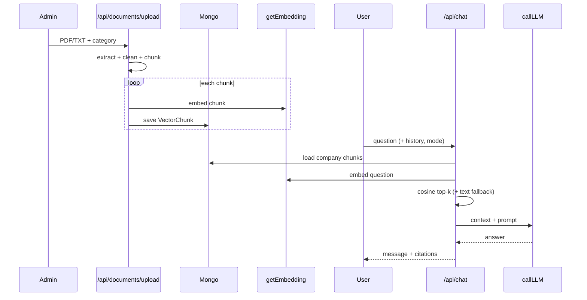
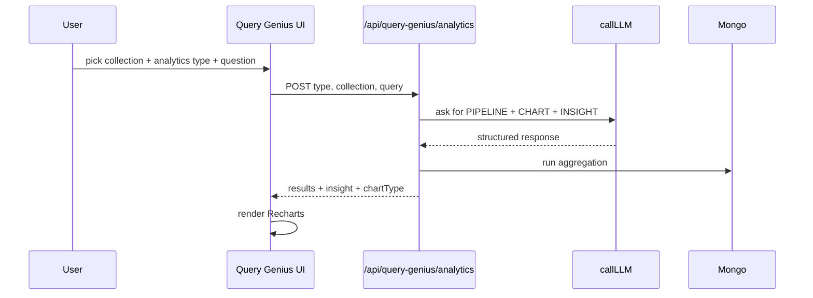
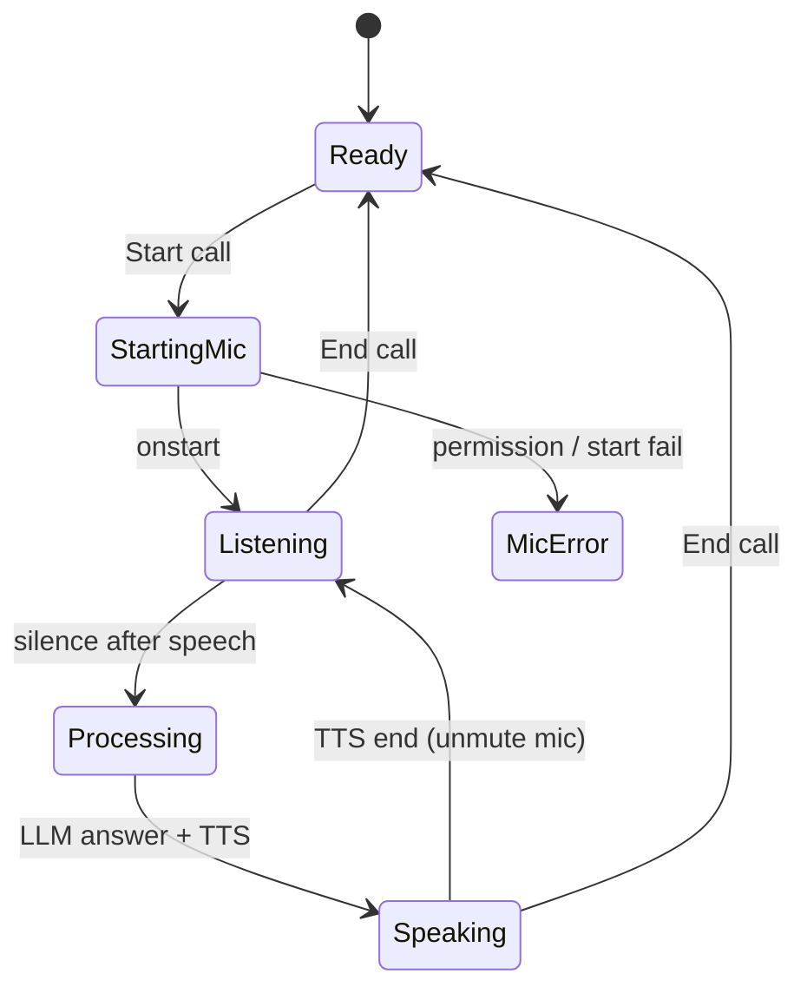

# Agento — Complete System Architecture & Interview Guide

> **Product:** Agento (pilot v0.2)  
> **Repo package name:** `synopsee`  
> **Stack:** Next.js 16 · React 19 · TypeScript 5 · MongoDB · Ollama / Groq · HuggingFace  
> **Purpose:** Multi-tenant enterprise AI assistant over company documents (RAG) + structured data (Query Genius) + voice + shareable guest links.

This document covers **architecture, features, APIs, workflows, methodology, and interview Q&A** (Frontend, Backend, AI/ML, RAG, Agents).

---

## Table of Contents

0. [Understanding the Project (Plain Language)](#0-understanding-the-project-plain-language)
1. [Executive Overview](#1-executive-overview)
2. [Tech Stack](#2-tech-stack)
3. [High-Level Architecture](#3-high-level-architecture)
4. [Directory Structure](#4-directory-structure)
5. [Features & User Journeys](#5-features--user-journeys)
6. [Authentication & Authorization](#6-authentication--authorization)
7. [Data Models](#7-data-models)
8. [API Catalog](#8-api-catalog)
9. [RAG Pipeline (Documents → Chat/Voice)](#9-rag-pipeline-documents--chatvoice)
10. [Query Genius (NL → MongoDB)](#10-query-genius-nl--mongodb)
11. [Voice Mode Architecture](#11-voice-mode-architecture)
12. [Guest / Public Link Architecture](#12-guest--public-link-architecture)
13. [LLM & Embedding Fallback Chain](#13-llm--embedding-fallback-chain)
14. [Rate Limiting & Subscriptions](#14-rate-limiting--subscriptions)
15. [Email Flows](#15-email-flows)
16. [Environment & External Connections](#16-environment--external-connections)
17. [Methodology & Design Patterns (Deep Dive)](#17-methodology--design-patterns-deep-dive)
18. [End-to-End Workflow Diagrams](#18-end-to-end-workflow-diagrams)
19. [Interview Q&A](#19-interview-qa)
20. [Known Caveats / Honest Trade-offs](#20-known-caveats--honest-trade-offs)

---

## 0. Understanding the Project (Plain Language)

### What problem does Agento solve?

Most companies already have knowledge locked in PDFs, policies, SOPs, and spreadsheets. Employees waste time searching Drive folders or pinging teammates for the same answers. Separately, business users who are not Mongo experts still want charts and “what happened / why / what next” insights from CSV-style data. Agento is built as a single product that attacks both problems for a company: **ask the documents** and **ask the tables**, with optional voice and a public guest link for external users.

### How to think about the product in one mental model

Imagine each company as an isolated “workspace.” Inside that workspace there are two knowledge surfaces:

1. **Unstructured knowledge (documents).** An admin uploads files. The system breaks them into smaller passages, converts each passage into a numeric vector (embedding), and stores those vectors. When someone asks a question, Agento finds the most similar passages and feeds them into an LLM so the answer is grounded in the company’s own text. That whole pattern is called **RAG (Retrieval-Augmented Generation)**.

2. **Structured knowledge (tables / CSVs).** A user uploads a CSV into Query Genius. The system stores rows in a MongoDB collection that is prefixed with that company’s ID. When the user asks an analytical question in English, the LLM does **not** invent the numbers. Instead it proposes a MongoDB aggregation pipeline; the server runs that pipeline on real data and returns rows, an insight, and often a chart. That pattern is **NL → Query (Text-to-Mongo)**.

Everything else in the app — login, roles, voice mode, guest iframe, usage limits — exists to make those two brains safe, usable, and shareable.

### Who uses it, and what each person does

An **admin** creates the company presence (or signs up as admin), uploads documents, verifies employees, manages the public guest link, and may handle subscription requests. An **employee** logs in after email verification and admin approval, then uses chat, voice, and Query Genius within the company boundary. A **guest** never creates an account; they open a tokenized link (or an iframe) and only see the features the admin exposed (chat and/or voice). Guests still hit the same company document corpus — they are not a separate AI; they are a different identity path into the same tenant.

### How a typical “day in the life” flows through the system

First the admin uploads an HR policy PDF. The upload API extracts text, cleans noisy lines, chunks the text into ~1000-character windows with overlap, embeds each chunk, and stores vectors tagged with `company_id`, filename, and category. Later an employee opens `/chat-voice`, types “How do I apply for leave?”, and the chat API embeds that question, compares it with up to 100 company chunks using cosine similarity, keeps scores above 0.2, takes the **top 5**, builds a prompt with those passages plus recent chat history, and calls the LLM (Ollama first, Groq if needed). The UI shows the answer and citations (which files were used). If the question looks like a process, a second LLM call may produce a Mermaid flowchart.

If the same employee switches to voice, the browser listens with SpeechRecognition, submits the transcript to the **same** `/api/chat` endpoint with `mode: "voice"`, and speaks a shorter answer with `speechSynthesis`. While the assistant is speaking, recognition is stopped so the mic does not hear the AI and loop.

Separately, in Query Genius, the employee uploads sales CSV data, asks “Show monthly revenue by region,” and either builds a chart manually (axes + aggregation) or lets AI propose a pipeline. For deeper analysis they pick Descriptive / Diagnostic / Predictive / Prescriptive; the server again asks the LLM for a pipeline and an insight, then executes the pipeline and charts the real results.

### What “architecture” means in this project

Architecture here is not a pile of microservices. It is a **Next.js full-stack application** acting as a **BFF (Backend for Frontend)**: React pages talk to Route Handlers under `/api/*`, those handlers talk to MongoDB and to LLM/embedding providers, and identity is either a NextAuth JWT session or a guest token header. The important architectural idea is **shared infrastructure, separated intelligence paths**: one auth layer, one tenancy key (`company_id`), one LLM helper (`lib/llm.ts`), but two different AI methodologies (RAG vs Text-to-Mongo) because unstructured text and tabular data need different treatment.

### Mental checklist before reading diagrams

When you look at any diagram in this document, map it to these questions:

1. **Who is the actor?** Admin, employee, or guest?  
2. **Which identity path?** Cookie session or `x-guest-token`?  
3. **Which brain?** Document RAG or Query Genius?  
4. **Where is truth stored?** `vector_store` passages, or `qg_{company}_*` rows?  
5. **Where does the model help?** Ranking/context (RAG), or writing a query/pipeline (QG)?  
6. **What must never leak?** Another company’s documents or collections.  

If you can answer those six for a feature, you understand that feature’s architecture.

---

## 1. Executive Overview

**Agento** is a **company-scoped (multi-tenant) AI platform**. In practical terms, that means many companies can use the same deployed app, but each company’s documents, chat history, Query Genius collections, and guest links are isolated by `company_id`. The product is intentionally “pilot-shaped”: one Next.js codebase, MongoDB for persistence, and a local-first LLM stack with cloud fallbacks so demos keep working when Ollama is down.

At a capability level, Agento offers:
| Capability | What it does |
|---|---|
| **AI Chat** | Ask questions over uploaded company documents (RAG) |
| **Voice Call** | Speak questions; browser STT → same RAG → TTS answer |
| **Document Ingest** | Admins upload PDF/TXT/CSV/MD/JSON → chunk → embed → store |
| **Query Genius** | Natural language CRUD + analytics over company CSV/Mongo collections |
| **LookUp Charts** | Manual or AI-generated Mongo aggregations → Recharts |
| **Public Guest Link** | Embeddable iframe chat/voice for external users (no login) |
| **Admin Panel** | Employees, subscriptions, public link feature toggles |

**Core idea:** One product with two AI “brains” that share identity and infrastructure but use different methods:

1. **Unstructured knowledge** → RAG over `vector_store` chunks (similarity search + grounded generation).  
2. **Structured data** → LLM generates MongoDB aggregations / filters against `qg_*` collections (query planning + real execution).  

Both share the same auth, tenancy (`company_id`), rate limits, and LLM fallback layer. That shared layer is why the project feels like one product rather than two disconnected tools.

**How to explain Agento in an interview (30 seconds):**  
“Agento is a multi-tenant enterprise assistant. Admins upload company documents; we chunk and embed them. Employees ask questions in chat or voice; we retrieve the top similar chunks and generate an answer with citations. Separately, Query Genius lets users upload CSVs and ask analytical questions in English; the LLM writes Mongo aggregations, we execute them, and we chart the results. Auth is NextAuth for staff and tokenized public links for guests.”

---

## 2. Tech Stack

The stack was chosen for **speed of building a full product**, not for maximum distributed-systems sophistication. Next.js App Router lets the same TypeScript project serve both UI and APIs. MongoDB stores users, documents, vectors, sessions, and dynamic Query Genius collections without forcing a rigid relational schema. Ollama keeps LLM/embeddings local during development; Groq and HuggingFace exist so production demos do not die when the laptop model is offline. Voice uses the browser Web Speech API so there is no custom audio streaming backend in the pilot.

| Layer | Technology | Role |
|---|---|---|
| Framework | **Next.js 16** (App Router) | UI + API Route Handlers (BFF) |
| UI | **React 19**, Tailwind 4, Radix/shadcn, Lucide, Framer Motion | Client-heavy dashboards |
| Language | **TypeScript 5** | Type-safe app + APIs |
| Auth | **NextAuth v4** (Credentials + JWT) | Login sessions (30 days) |
| Database | **MongoDB** via **Mongoose 9** | Users, docs, vectors, sessions, links |
| Admin DB | Separate Mongo DB `AgentoAdmin` | Subscription request queue |
| Local LLM | **Ollama** (`/api/generate`) | Primary chat/completions |
| Cloud LLM | **Groq** OpenAI-compatible API | Fallback if Ollama fails |
| Local embeddings | Ollama **nomic-embed-text** (~768-d) | Primary embeddings |
| Cloud embeddings | HuggingFace **all-MiniLM-L6-v2** (~384-d) | Fallback embeddings |
| PDF | **unpdf** | Extract text from PDFs |
| Charts | **Recharts** | Query Genius visualizations |
| Diagrams | **Mermaid** (CDN in client) | Optional process flowcharts in chat |
| Email | **Nodemailer** + Gmail SMTP | Verify, reset, subscription emails |
| Voice | Browser **Web Speech API** | STT + TTS (no server audio pipeline) |

**Not in production Next path:** OpenAI SDK, Gemini, Streamlit (`queryGenius/query.py` is a **legacy prototype** only). Knowing that distinction matters: if you open `queryGenius/query.py`, you are looking at history, not the live architecture.

---

## 3. High-Level Architecture

### How to read the architecture

Think of Agento as three concentric layers. The **outer layer** is clients: logged-in browser apps, the admin UI, and guest iframes. The **middle layer** is Next.js: pages for interaction and `/api` route handlers for business logic. The **inner layer** is data and AI providers: MongoDB for state, Ollama/Groq for text generation, and Ollama/HuggingFace for embeddings.

Requests always enter through the middle layer. Pages almost never talk to Ollama or Mongo directly from the browser for privileged work; they call APIs, and APIs enforce auth, tenancy, and rate limits before touching data or models. That is the BFF idea: the backend is shaped for this UI and this product, not offered as a generic public AI API.

Guest mode is the same middle layer with a different front door. Instead of a NextAuth cookie, the client sends `x-guest-token`. The server resolves that token to a company and feature list, then reuses chat/RAG routes. Architecturally, guest is an identity adapter, not a second product.

```
┌─────────────────────────────────────────────────────────────────────────────┐
│                              CLIENTS                                        │
│  Browser (employees)  │  Admin panel  │  Guest iframe (/guest/:token)       │
│  Web Speech STT/TTS   │  Recharts     │  x-guest-token header               │
└───────────────┬─────────────────────┬───────────────────┬───────────────────┘
                │                     │                   │
                ▼                     ▼                   ▼
┌─────────────────────────────────────────────────────────────────────────────┐
│                     NEXT.JS APP ROUTER (BFF)                                │
│  Pages (CSR + useSession)     │     Route Handlers /api/*                   │
│  /dashboard /chat-voice       │     Auth · Chat · Docs · QG · Guest         │
│  /query-genius /admin /guest  │     JWT session OR guest token              │
└───────────────┬─────────────────────┬───────────────────┬───────────────────┘
                │                     │                   │
     ┌──────────┴──────────┐   ┌──────┴──────┐   ┌───────┴────────┐
     ▼                     ▼   ▼             ▼   ▼                ▼
┌──────────┐        ┌────────────┐   ┌────────────┐      ┌──────────────┐
│ MongoDB  │        │  Ollama    │   │   Groq     │      │ HuggingFace  │
│ Agento   │        │ LLM+Embed  │   │ LLM fallback│      │ Embed fallback│
│ + Admin  │        └────────────┘   └────────────┘      └──────────────┘
└──────────┘
     │
     ├── users, documents, vector_store, chat_sessions, public_links
     ├── qg_{companyId}_*  (Query Genius data)
     └── AgentoAdmin.subscription_requests
```

### Architecture understanding points (study these, not only the box diagram)

1. **Single deployable, two AI paths.** Chat/voice RAG and Query Genius both live in one Next app, but they solve different data shapes. Do not describe the whole product as “just RAG” or “just an agent.”

2. **Tenancy is the spine.** Almost every serious query is scoped by `company_id`. For documents that is a metadata filter; for Query Genius it is baked into the collection name (`qg_{companyId}_...`). If tenancy breaks, the product is unsafe regardless of how good the LLM is.

3. **APIs are the control plane.** Rate limits, auth checks, embedding calls, and Mongo writes happen in route handlers. The React pages are orchestration and UX.

4. **LLM access is centralized.** Features should call `callLLM` / `getEmbedding` rather than inventing their own provider clients. That makes failover and model swaps a library concern.

5. **Voice is a client modality.** The server still receives text. Speech-to-text and text-to-speech happen in the browser; `/api/chat` remains the intelligence endpoint.

6. **Degradation is designed in.** If Ollama is down, Groq can answer. If embeddings fail, regex text search can still retrieve something. If AI LookUp is rate-limited, manual LookUp still works. Architecture resilience is intentional, not accidental.

7. **Admin DB separation.** Subscription requests sit in `AgentoAdmin` so billing/ops workflow is not mixed into the main product database schema as tightly. Product tenants still live in `Agento`.

### Connection map (who talks to whom)

| From | To | How |
|---|---|---|
| Browser pages | `/api/*` | `fetch` + cookies (NextAuth) or `x-guest-token` |
| `/api/chat` | Mongo `vector_store` | Load chunks → cosine similarity |
| `/api/chat` | `lib/llm.ts` | `getEmbedding` + `callLLM` |
| `/api/documents/upload` | `unpdf` + embeddings + Mongo | Ingest pipeline |
| `/api/query-genius/*` | Raw Mongo + LLM | NL → aggregation / CRUD |
| Auth routes | `User` + Nodemailer | Signup / verify / reset |
| Admin public-link | `PublicLink` | Guest identity source |
| Rate limit | `User` counters | Increment before expensive AI calls |

**Reading tip:** every arrow above is a trust boundary. Browser → API needs auth. API → Mongo needs tenant filters. API → LLM needs prompt discipline and output parsing. If you can explain those three boundaries, you can defend the architecture in an interview.

---

## 4. Directory Structure

```
The-Agento/
├── app/                          # Next.js App Router
│   ├── api/
│   │   ├── auth/                 # NextAuth, signup, email, admin, public-link, usage
│   │   ├── chat/                 # RAG chat + session CRUD
│   │   ├── documents/            # Upload + debug
│   │   ├── guest/                # Token validate
│   │   └── query-genius/         # Collections, schema, query, upload, analytics, lookup, data
│   ├── admin/                    # Admin UI
│   ├── chat-voice/               # Primary unified chat + voice
│   ├── chat/ · voice-call/       # Legacy separate UIs
│   ├── guest/[token]/           # Public guest experience
│   ├── dashboard/ · ingest-doc/ · query-genius/ · pricing/
│   ├── login/ · signup/ · verify-email/ · forgot-password/ · reset-password/
│   ├── layout.tsx · page.tsx · SessionProviderWrapper.tsx
├── components/                   # UI + PricingModal
├── lib/                          # db, llm, guestAuth, rateLimit, email, token, utils
├── models/                       # Mongoose schemas
├── queryGenius/query.py          # Legacy Streamlit prototype (NOT wired to Next)
├── types/                        # next-auth + global mongoose cache
├── public/                       # logo, assets
├── README.md
└── ARCHITECTURE.md               # this file
```

---

## 5. Features & User Journeys

Features in Agento are best understood as **user journeys**, not as isolated screens. A company starts by getting accounts and documents into the system; only then do chat, voice, and analytics become useful. The dashboard is the hub: it shows remaining AI usage and routes people into the right tool. `/chat-voice` is the primary conversational surface (text and speech). `/query-genius` is the structured-data surface. `/admin` and `/ingest-doc` are control-plane surfaces for company admins. `/guest/[token]` is the external, account-less surface.

When you demo or explain a feature, always say what happens **before** the user clicks (who uploaded data, who is authenticated) and what happens **after** (which API, which store, which model). That narrative is stronger than listing menu items.

### 5.1 Pages / routes

| Route | Audience | Purpose |
|---|---|---|
| `/` | Public | Marketing landing |
| `/login` · `/signup` | Public | Credentials auth |
| `/verify-email` · `/forgot-password` · `/reset-password` | Public | Email lifecycle |
| `/dashboard` | Logged-in | Hub + usage meters + feature links |
| `/chat-voice` | Logged-in | **Primary** Chat ↔ Voice toggle (same RAG) |
| `/chat` · `/voice-call` | Logged-in | Legacy dedicated UIs |
| `/ingest-doc` | Admin | Upload & categorize documents |
| `/query-genius` | Logged-in | Structured data NL + charts + analytics |
| `/admin` | Admin | Employees, subscriptions, public link |
| `/pricing` | Logged-in | Plans + UPI upgrade request |
| `/guest/[token]` | External | Chat/voice without account |

### 5.2 Feature summary (with “why it exists”)

1. **Unified Chat + Voice** — Users should not learn two products for the same knowledge base. One page toggles modality; voice uses shorter prompts because spoken answers must be brief.  
2. **Document Ingestion** — Without curated company text in `vector_store`, chat is just a generic LLM. Ingest is the foundation of RAG quality.  
3. **RAG Q&A** — Retrieves relevant passages before generating, so answers can cite real files instead of inventing policy.  
4. **Mermaid flowcharts** — Process questions are easier to understand visually; a second LLM call turns steps into a diagram when keywords suggest a workflow.  
5. **Query Genius** — Spreadsheet/CSV questions need exact aggregates, not semantic paragraph search. NL→Mongo is the right tool for that.  
6. **LookUp** — Gives both power users (manual axes) and natural-language users (AI charts) a path to visualization.  
7. **Analytics modes** — Frames the same engine with different business intents (what / why / what next / what to do).  
8. **Guest link** — Lets companies embed assistance on their site without forcing account creation; feature flags keep scope controlled.  
9. **Usage limits** — Protects free-tier cost and nudges upgrades without needing a full payment gateway in the pilot.

---

## 6. Authentication & Authorization

Security in Agento is mostly about **who you are** and **which company you belong to**. There is no fancy zero-trust mesh; there is careful identity gating. Staff users authenticate with email/password through NextAuth, receive a JWT session that carries `company_id` and `role`, and then every sensitive API reads that session. Employees have an extra gate: even after proving email ownership, an admin must mark the account verified before they are treated as fully trusted members of the company.

Guests are intentionally different. They are not rows in `User`. Their proof of access is a `PublicLink` token. That design lets a company share chat/voice externally without opening signup, while still binding every guest request to one tenant and an explicit feature list.

### 6.1 Roles

| Role | How created | Capabilities |
|---|---|---|
| **admin** | Signup with admin role | Docs ingest, employee verify, public link, subscription admin APIs |
| **employee** | Signup under company | Chat/voice/query after **email verify** + **admin account verify** |
| **guest** | Not a User row | Synthetic identity via `PublicLink` token; scoped to company + features |

### 6.2 Login gate flow

```
Signup
  → bcrypt hash password
  → admins: accountVerified = true
  → employees: accountVerified = false (pending admin)
  → email verification token (SHA-256 stored, ~24h)
  → Login blocked until emailVerified
  → Employees also need accountVerified
  → NextAuth Credentials → JWT (id, company_id, company_name, role, accountVerified)
```

### 6.3 Guest identity

```
Admin creates PublicLink (token, features[], enabled)
Guest opens /guest/{token}
  → GET /api/guest/validate
  → Client stores company + features
API calls send header: x-guest-token: <token>
Server: resolveGuestToken() → { company_id, features, email: guest@{token} }
```

---

## 7. Data Models

### `User`
- Identity: `name`, `email`, `password`
- Tenant: `role`, `company_id`, `company_name`
- Verification: `emailVerified`, tokens/expiry; `accountVerified`, `verifiedBy`
- Usage: `chatCallCount`, `voiceCallCount`, `queryCallCount`
- Subscription: `subscription`, `subscriptionPlan`, `subscriptionExpiry`

### `Document` (`documents`)
- `company_id`, `filename`, `category`, `uploaded_by`, `upload_date`, optional `full_text`

### `VectorChunk` (`vector_store`)
- `metadata.{company_id, category, filename, uploaded_by}`
- `textContent`, `vectorContent: number[]`, `embeddingModel` (isolates 768-d vs 384-d)

### `ChatSession` (`chat_sessions`)
- `company_id`, `user_email`, `title`, `mode` (`chat` | `voice`)
- `messages[]`: role, content, optional mermaid + citations

### `PublicLink` (`public_links`)
- `token`, `company_id`, `company_name`, `enabled`, `features[]`, `guestCallCount`, `expiresAt?`

### `SubscriptionRequest` (Admin DB)
- User/company/plan/status timestamps; approved by super-admin email flow

### Query Genius collections (raw Mongo, not Mongoose models)
- Data: `qg_{company_id}_{collectionName}`
- Meta/schema: `qg_meta_{company_id}`

---

## 8. API Catalog

### Auth & identity

| Endpoint | Methods | Auth | Purpose |
|---|---|---|---|
| `/api/auth/[...nextauth]` | GET/POST | Public | Login / session |
| `/api/auth/signup` | POST | Public | Register + verification email |
| `/api/auth/verify-email` | POST | Public | Confirm email |
| `/api/auth/forgot-password` | POST | Public | Reset email |
| `/api/auth/reset-password` | POST | Public | Set new password |
| `/api/auth/change-password` | POST | Session | Change password |
| `/api/auth/companies` | GET | Public | Company list for signup |
| `/api/auth/usage` | GET | Session | Feature used/limit |
| `/api/auth/public-link` | GET/POST/PATCH/DELETE | Admin | Guest link lifecycle |
| `/api/auth/admin/employees` | GET/PATCH | Admin | Approve/reject employees |
| `/api/auth/subscription/request` | POST | Session | Request paid plan |
| `/api/auth/admin/subscription-requests` | GET/PATCH/DELETE | Admin | Approve/reject plans |
| `/api/guest/validate` | GET | Public | Validate guest token |

### Chat / RAG

| Endpoint | Methods | Auth | Purpose |
|---|---|---|---|
| `/api/chat` | POST | Session **or** guest | RAG answer (+ mermaid, citations) |
| `/api/chat/sessions` | GET/POST | Session or guest | List / create sessions |
| `/api/chat/sessions/[id]` | GET/PATCH/DELETE | Session or guest | Load / append / delete |

**Chat body:** `{ message, history?, mode?: "chat" | "voice" }`  
**Chat response:** `{ message, mermaidCode?, citations? }`

### Documents

| Endpoint | Methods | Auth | Purpose |
|---|---|---|---|
| `/api/documents/upload` | GET/POST | Admin | List docs / upload+ingest |
| `/api/documents/debug` | GET | Session | Chunk/doc counts |

### Query Genius

| Endpoint | Methods | Auth | Purpose |
|---|---|---|---|
| `/api/query-genius/collections` | GET | Session | List company collections |
| `/api/query-genius/schema` | GET | Session | Infer/view schema |
| `/api/query-genius/data` | GET/DELETE | Session | Preview / drop collection |
| `/api/query-genius/upload` | POST | Session | CSV upload + schema |
| `/api/query-genius/query` | POST | Session | read/insert/update/delete |
| `/api/query-genius/analytics` | POST | Session | 4 analytics modes |
| `/api/query-genius/lookup` | POST | Session | Manual or AI charts |

---

## 9. RAG Pipeline (Documents → Chat/Voice)

RAG is Agento’s answer to the question: *“How do we make the model talk about our documents without fine-tuning a new model per company?”* The approach is: store company text as searchable chunks, retrieve the best chunks for each question, and only then ask the LLM to write an answer using that context. The model remains general; the **retrieval layer** supplies company-specific knowledge.

There are two phases. **Ingest** happens when an admin uploads a file (offline relative to the chat turn). **Retrieve + generate** happens on every user question (online). Quality depends on both: bad cleaning/chunking at ingest cannot be fixed by a clever prompt later, and good chunks still fail if retrieval thresholds or tenancy filters are wrong.

### 9.1 Ingest (offline / admin)

```
File upload (admin)
  → PDF: unpdf extract | TXT/MD/CSV/JSON: text
  → cleanText (noise filtering)
  → chunkText (~1000 chars, overlap)
  → for each chunk: getEmbedding(text)
  → save VectorChunk + Document metadata (company_id, category, filename)
```

In plain language: extract readable text, throw away junk lines from PDFs, split into overlapping windows of about **1000 characters**, embed each window, and store vectors with metadata so later search can stay inside one company and cite the source file. Categories (HR, Engineering, Sales, Marketing, Finance, Legal, Operations, General) are assigned at upload time and mainly help humans organize and cite content.

### 9.2 Retrieve + generate (online)

```
User question
  → Auth: session company_id OR guest company_id
  → Rate limit check (chat or voice)
  → Load up to ~100 company VectorChunks
  → Embed query (same embeddingModel filter)
  → Cosine similarity; keep score > 0.2; top K = 5
  → Fallback: regex / text search on textContent if vectors weak
  → Build prompt = system + retrieved context + last ~6 history turns
  → callLLM(...)
  → Optional Mermaid generation
  → Return answer + citations {filename, category}
  → Client may PATCH session to persist messages
```

**Top-K and related limits (exact code behavior):** after cosine scoring, Agento keeps chunks with `score > 0.2`, sorts by score descending, and takes **Top-K = 5**. Before scoring it loads at most **100** chunks for that company. If vector retrieval returns nothing useful, a case-insensitive regex search on `textContent` can return up to **10** chunks as fallback. These numbers are heuristics for the pilot: small enough for in-memory scoring in Node, large enough for short policy answers.

Understanding tip: Top-K does not mean “always five chunks in the prompt.” It means “at most five after the score filter.” If only two chunks beat 0.2, the prompt only gets two.

### 9.3 Chat vs voice prompts

| Aspect | Chat | Voice |
|---|---|---|
| Style | Detailed, structured | Short (2–3 sentences), spoken language |
| Post-process | Full text + optional Mermaid | Truncate long answers for TTS |
| Rate feature key | `chat` | `voice` |

The retrieval path is the same; only the **generation contract** changes. Voice must be hearable in a few seconds of speech, so the system prompt asks for brevity and the API may truncate long replies at a sentence boundary (around 500 characters).

### 9.4 What this RAG is (and is not)

| Is | Is not |
|---|---|
| Classic **retrieve-then-generate** | LangChain/LlamaIndex agent framework |
| App-side **cosine** over Mongo arrays | MongoDB Atlas Vector Search / Pinecone |
| Multi-tenant by `company_id` | Cross-company retrieval |
| Embedding-model aware | Mixed-dimension search in one query |

For interviews: call it **application-side vector RAG with hybrid lexical fallback**, not “we built a vector database.” The storage is Mongo arrays; the similarity engine is JavaScript cosine over a capped candidate set.

---

## 10. Query Genius (NL → MongoDB)

Query Genius exists because RAG is the wrong tool for questions like “What was total revenue last quarter by region?” Those answers live in rows and columns, not in paragraph embeddings. The methodology flips: instead of retrieving text for the LLM to paraphrase, Agento asks the LLM to **propose a MongoDB aggregation or filter**, then the server **executes** that proposal against real company collections and returns factual results (plus optional charts and narrative insight).

**Live path = Next.js APIs only.** The Streamlit file `queryGenius/query.py` is historical. When you explain QG architecture, stick to `/api/query-genius/*`.

Collections are namespaced as `qg_{company_id}_{name}` so even a buggy pipeline cannot easily wander into another tenant’s table name. Schema is largely **inferred** from sample documents (types, nullability, uniqueness, enums, autoincrement-like ids), which lets the UI validate inserts and gives the LLM field hints without forcing users to write formal schemas first.

| Operation | Mechanism |
|---|---|
| Upload CSV | Validate against schema; replace or append; store meta |
| Schema infer | Sample docs → types, nullable, unique, enums |
| Read | LLM → aggregation pipeline JSON → execute |
| Insert | Form + schema validation (often **no** LLM) |
| Update / Delete | LLM → filter (+ `$set`) → guarded `updateMany` / `deleteMany` |
| LookUp manual | Client chooses X/Y/agg → pipeline → Recharts |
| LookUp AI | LLM returns PIPELINE + CHART_TYPE |
| Analytics | descriptive / diagnostic / predictive / prescriptive → pipeline + insight + chart |

**Understanding point:** Insert is deliberately less “AI magic” and more form validation — writes need stronger guarantees than reads. Analytics and AI LookUp use a strict text contract (`PIPELINE` / `CHART_TYPE` / `INSIGHT`) so the server can parse model output defensively. Predictive/prescriptive modes in the Next app are **LLM-framed analytics**, not separately trained forecasting models.

---

## 11. Voice Mode Architecture

Voice mode is easy to misunderstand. Agento does **not** stream raw audio to a custom speech server in the pilot. The browser converts speech to text (STT), the server runs the same RAG chat API on that text, and the browser reads the answer aloud (TTS). Architecturally, voice is a UX shell around `/api/chat` with `mode: "voice"`.

The hard part is not “calling an API” — it is **conversation control**: when to start listening, when to stop, how to detect end of utterance (silence timer), and how to prevent the assistant’s own voice from being transcribed as the next user message. That last issue is why recognition is muted while TTS plays (half-duplex). Refs are used in event handlers so restart logic does not read stale React state and accidentally leave the mic dead or always on.

```
[Start Call]
  → ensureMicPermission (getUserMedia audio, then stop tracks)
  → SpeechRecognition.start() (continuous, interimResults)
  → UI: Listening / Mic On (only after onstart)

[User speaks]
  → onresult interim/final transcript
  → silence timer (~1.5s) → submit

[Submit]
  → stop recognition (mute input)
  → POST /api/chat { mode: "voice", message, history }
  → set Speaking
  → speechSynthesis.speak(answer)
  → onend → restart recognition if still in call

[While AI speaks]
  → recognition stopped (prevents echo / system-audio feedback)

[Errors]
  → ignore "aborted" (expected on stop)
  → not-allowed → end call
  → other → show Mic error
```

**Browsers:** Chrome/Edge work best. Needs HTTPS (or localhost). Guest iframes need `allow="microphone"`. If voice “shows Listening but never responds,” check permission, secure origin, and whether `onstart` / `onresult` actually fire — the UI can only reflect what the browser speech engine reports.

---

## 12. Guest / Public Link Architecture

Guest mode is Agento’s embeddable distribution channel. A company admin generates a public link, chooses whether chat and/or voice are exposed, and can disable or regenerate the token later. External sites embed `/guest/{token}` in an iframe with microphone permission if voice is enabled.

From an architecture view, the important idea is reuse: guests do not get a separate RAG stack. After token validation, they call the same chat APIs with `x-guest-token`. Sessions are stored under a synthetic email like `guest@{token}` so history can still be grouped without creating full user accounts. Usage is tracked on the link (`guestCallCount`) so admins can see how heavily the public surface is used.

```
Admin Panel
  → POST /api/auth/public-link  (create token)
  → PATCH features: ["chat","voice"]
  → Copy URL / embed iframe

External site iframe
  → src=/guest/{token} allow="microphone"
  → Guest UI validates token
  → Feature-gated Chat / Voice tabs
  → APIs use x-guest-token
  → Sessions stored under user_email guest@{token}
  → guestCallCount incremented on AI use
```

---

## 13. LLM & Embedding Fallback Chain

Implemented in `lib/llm.ts`:

### Completions — `callLLM`
```
1) Ollama  POST {OLLAMA_URL}/api/generate
2) Groq_API_1 → Groq_API_2 → Groq_API_3
   POST https://api.groq.com/openai/v1/chat/completions
```

### Embeddings — `getEmbedding`
```
1) Ollama /api/embeddings  (nomic-embed-text → ~768-d)
2) HuggingFace featureExtraction (MiniLM → ~384-d)
3) Empty vector → text/regex retrieval fallback
```

**Why store `embeddingModel` on chunks?** So a 768-d corpus is never cosine-compared with a 384-d query vector.

---

## 14. Rate Limiting & Subscriptions

| Plan | Chat/Voice | Query Genius AI ops |
|---|---|---|
| Starter / inactive | ~10 | ~10 |
| Pro-Chat | ~500 chat+voice | low query |
| Pro-Query | low chat/voice | ~500 |
| Business | unlimited | unlimited |
| `ADMIN_MAIL` | bypass | bypass |

- **Pattern:** increment-then-check; rollback + **429** if over limit.  
- **Counted:** chat messages, voice queries, QG read/update/delete, analytics, AI LookUp.  
- **Not counted:** uploads, schema, inserts, manual LookUp.  
- **Payments:** manual UPI via email — not Stripe.

---

## 15. Email Flows

| Event | To | Purpose |
|---|---|---|
| Signup | User | Email verification |
| Forgot password | User | Reset link (~15 min) |
| Subscription request | Admin mailbox | New upgrade request |
| Subscription queued | User | UPI instructions |
| Approved / Rejected | User | Plan outcome |

SMTP via `EMAIL_*` env vars.

---

## 16. Environment & External Connections

| Variable | Connection |
|---|---|
| `MONGO_URI` | Main DB (`Agento`) |
| `MONGO_URI_ADMIN` | Subscription DB (`AgentoAdmin`) |
| `NEXTAUTH_SECRET` / `NEXTAUTH_URL` | Auth |
| `OLLAMA_URL` / `OLLAMA_MODEL` / `OLLAMA_EMBEDDING_MODEL` | Local AI |
| `Groq_API_1..3` | Cloud LLM |
| `HF_TOKEN` / `HF_EMBEDDING_MODEL` | Cloud embeddings |
| `EMAIL_*` | Gmail SMTP |
| `ADMIN_MAIL` / `NEXT_PUBLIC_ADMIN_MAIL` | Super-admin + UI gate |
| `NEXT_PUBLIC_ADMIN_UPI_PHONE_NO` | Pricing UPI display |

---

## 17. Methodology & Design Patterns (Deep Dive)

This section is the **“how and why”** behind every major subsystem — strategies, algorithms, design patterns, and interview-ready justifications grounded in the actual code.

**One-line pitch:**  
> “We built a multi-tenant RAG SaaS on Next.js as a full-stack BFF, with app-side vector retrieval over MongoDB, LLM provider failover, and a second NL-to-Mongo analytics surface for structured data.”

---

### 17.0 Pattern catalog (quick map)

| Pattern / methodology | Where used | Intent |
|---|---|---|
| Backend-for-Frontend (BFF) | `app/api/*` | One deployable; UI-shaped APIs |
| Shared-nothing multi-tenancy | `company_id` everywhere | Isolate customers |
| RBAC + feature flags | roles + PublicLink.features | Least privilege |
| Retrieve-then-Generate (RAG) | docs → chat/voice | Ground answers in company docs |
| Fixed-size chunking + overlap | `chunkText` | Balance recall vs context |
| Hybrid retrieval | cosine → regex fallback | Resilience when vectors fail |
| Provider cascade / Circuit-style failover | `callLLM`, `getEmbedding` | Local-first, cloud backup |
| Embedding-space isolation | `embeddingModel` field | Never mix 768-d with 384-d |
| Prompt specialization | chat vs voice system prompts | Channel-appropriate answers |
| Secondary LLM call (tool-like) | Mermaid flowchart | Structured diagram generation |
| NL → Query (Text-to-Mongo) | Query Genius read/update/delete | Structured analytics without SQL skill |
| Schema-on-read inference | `inferSchema` | Soft constraints without rigid DDL |
| Guardrails / validate-then-execute | QG insert/update/delete | Stop bad LLM or form writes |
| Dual-path LookUp | manual pipeline vs AI pipeline | Power users + NL users |
| Analytics intent taxonomy | 4D analytics prompts | Descriptive→Prescriptive framing |
| Optimistic rate metering | increment-then-check-rollback | Simple usage enforcement |
| Half-duplex voice | mute STT while TTS | Kill feedback loops |
| Token-based guest identity | PublicLink | Embed without full accounts |
| Dual database | Agento vs AgentoAdmin | Separate product vs billing ops |

---

### 17.1 Overall software methodology

| Decision | Choice | Why |
|---|---|---|
| Architecture style | **Monolithic full-stack Next.js** (App Router) | Pilot speed; no microservices tax |
| API style | REST Route Handlers (JSON) | Simple, browser-native `fetch` |
| UI rendering | Mostly **CSR** + session cookies | Interactive dashboards, voice, charts |
| Persistence | MongoDB document store | Flexible docs + vectors + sessions in one DB |
| AI integration | Thin `lib/llm.ts` wrapper | Swap providers without rewriting features |
| Security model | JWT session + guest token header | Two identity modes, one company scope |
| Delivery model | SaaS multi-tenant | One app, many companies |

**Not used (and why that matters in interviews):** no LangChain/LlamaIndex agent graph, no dedicated vector DB, no Stripe webhook billing, no WebRTC voice server. Those are deliberate pilot trade-offs, not omissions by accident.

---

### 17.2 Multi-tenancy methodology

**Strategy:** *Shared database, shared collections, row-level (document-level) isolation by `company_id`.*

| Concern | Implementation |
|---|---|
| User tenancy | `User.company_id` / `company_name` |
| RAG isolation | Vector query: `"metadata.company_id": companyId` |
| Chat history | `ChatSession.company_id` + `user_email` |
| Query Genius | Physical collection prefix `qg_{companyId}_{name}` |
| Guest | Inherits `PublicLink.company_id` |

**Pattern name:** Shared-schema multi-tenancy with **namespace prefixing** for structured data (stronger isolation than a soft filter alone).

**Interview answer:** “We chose shared Mongo with `company_id` filters for RAG, and hard collection namespacing for Query Genius so aggregations cannot accidentally scan another tenant’s tables.”

---

### 17.3 Auth / identity design patterns

| Pattern | Detail |
|---|---|
| Credentials + JWT | NextAuth stores company/role claims in token |
| Defense in depth | Email verification **and** admin `accountVerified` for employees |
| Synthetic guest principal | `guest@{token}` email for session ownership without User row |
| Capability flags | Guest UI/API gated by `features: ["chat","voice"]` |
| Admin bypass | `ADMIN_MAIL` skips rate limits for ops testing |

---

### 17.4 RAG methodology (full strategy)

Agento’s document AI is classic **Retrieve-Augmented Generation** with these concrete stages:

```
Extract → Clean → Chunk → Embed → Store
                ↘
Query → Embed → Filter(tenant + model) → Rank(cosine) → Top-K → Prompt → Generate → Cite
                                      ↘ if empty: Keyword/Regex fallback
```

#### 17.4.1 Document extraction strategy

| File type | Method |
|---|---|
| PDF | `unpdf` (`getDocumentProxy` + `extractText`, merge pages) |
| TXT / MD / CSV / JSON | `file.text()` as UTF-8 |

**Allowed extensions:** `.pdf`, `.txt`, `.md`, `.csv`, `.json`  
**Category taxonomy (manual tagging at upload):** HR, Engineering, Sales, Marketing, Finance, Legal, Operations, General — used later for **citations**, not for retrieval filtering today.

#### 17.4.2 Cleaning strategy (`cleanText` / `isGoodText`)

PDF extraction is noisy (headers, footers, glyphs). Cleaning is a **line-quality filter**:

1. Split into lines  
2. Keep a line only if:
   - length ≥ 10  
   - alphanumeric ratio ≥ 40%  
   - at least 2 alphabetic words of length ≥ 3  
3. Join surviving lines into one space-normalized paragraph string  
4. Fix spacing before punctuation  

**Pattern:** Heuristic OCR/PDF denoise before chunking (improves embedding quality).

#### 17.4.3 Chunking strategy (`chunkText`) — important for interviews

| Parameter | Value in code | Meaning |
|---|---|---|
| **Chunk size** | **~1000 characters** | Target max length per chunk |
| **Overlap** | **~200 characters** (implemented as last `floor(200/5)=40` words carried forward) | Continuity across boundaries |
| **Unit** | Word-based accumulation | Split on whitespace, grow until size exceeded |
| **Min doc** | Skip if cleaned text &lt; 50 chars | Reject empty/garbage files |
| **Min chunk source** | If text &lt; 50 chars → no chunks | Guard |

**Algorithm (sliding window / fixed-size with overlap):**

1. Split cleaned text into words.  
2. Append words into `current` until `(current + word).length > 1000`.  
3. Push `current` as a chunk.  
4. Start next chunk with **tail of previous words** (`slice(-overlap/5)`) + new word → soft overlap.  
5. Push final remainder.

**Why this strategy?**

| Goal | How chunking helps |
|---|---|
| Fit embedding model context | Smaller passages embed cleaner than whole PDFs |
| Improve recall | Specific paragraphs match questions better than giant blobs |
| Preserve continuity | Overlap reduces answers cut mid-sentence across chunk borders |
| Simple to implement | Character budget is easy to reason about vs recursive/semantic splitters |

**What it is *not*:**  
Not semantic chunking, not recursive CharacterTextSplitter, not sentence-window retrieval, not parent-document retriever. For interviews: “We used **fixed-size word-window chunking with overlap** as a pragmatic baseline.”

**Trade-offs to mention:**

- Pros: deterministic, fast, good enough for policy/HR docs.  
- Cons: may split mid-section; no heading-aware splits; overlap heuristic is approximate (`overlap/5` words, not exact 200 chars).

#### 17.4.4 Embedding strategy

| Step | Behavior |
|---|---|
| Per chunk | Call `getEmbedding(chunk)` → store `vectorContent` + `embeddingModel` |
| Failure per chunk | Log warn, skip that chunk (don’t fail whole upload if some succeed) |
| Whole upload fail | If **zero** embeddings → 500 |
| Local model | Ollama `nomic-embed-text` → typically **768-d** |
| Cloud fallback | HF `all-MiniLM-L6-v2` → typically **384-d** |

**Design rule:** *Always persist which model produced the vector* so query-time cosine never mixes spaces.

#### 17.4.5 Retrieval strategy (hybrid)

**Primary — Dense / semantic retrieval**

1. Load up to **100** chunks for `company_id` (pilot cap).  
2. Embed the user query.  
3. Keep only chunks where `embeddingModel === queryModel`.  
4. Score with **cosine similarity**:

\[
\text{cosine}(a,b) = \frac{a\cdot b}{\|a\|\|b\|}
\]

5. Filter `score > 0.2` (absolute threshold).  
6. Sort descending, take **Top-K = 5**.  
7. Join chunk texts with `\n\n---\n\n` as CONTEXT.

**Secondary — Sparse / lexical fallback**

If no vector hits: Mongo `$regex` (case-insensitive) on `textContent`, limit 10.

**Pattern name:** **Hybrid retrieval** (dense first, lexical backup) without a full BM25 index.

**Why threshold 0.2 and K=5?**  
- Threshold drops weak matches that pollute the prompt.  
- Top-5 balances context richness vs LLM context window / cost.  
Interview note: these are **heuristic hyperparameters**, not learned.

#### 17.4.6 Generation / prompting strategy

| Mode | System prompt strategy | Post-process |
|---|---|---|
| **Chat** | Company-named assistant; “use CONTEXT”; encourage numbered steps for processes | Full answer |
| **Voice** | “Agento”; max 2–3 sentences; simple language | Truncate &gt;500 chars at sentence boundary |

**Conversation memory:** last **6** history turns concatenated into the prompt (sliding window memory — not a vector memory store).

**Grounding pattern:** Context block injected into system prompt (“CONTEXT: …”). If empty: model may give general answer / admit missing docs (prompt-dependent).

#### 17.4.7 Citation strategy

- Map retrieved chunks → `{ filename, category }`  
- Deduplicate by filename (`Map`)  
- Return alongside answer for UI trust / audit

#### 17.4.8 Flowchart secondary generation (agent-like tool step)

**Trigger methodology:** keyword heuristic `needsFlowchart(query)`  
(e.g. “how to”, “steps”, “process”, “workflow”, “onboarding”, …)

**If triggered:** second LLM call with strict Mermaid rules → parse/clean → optional `mermaidCode`.

**Pattern:** *Conditional secondary LLM call* (lightweight tool use without an agent framework). Not a full ReAct loop.

#### 17.4.9 RAG pattern summary table

| Stage | Method | Code location |
|---|---|---|
| Extract | unpdf / text | `documents/upload` |
| Clean | line heuristics | `cleanText` |
| Chunk | ~1000 chars + overlap | `chunkText` |
| Embed | Ollama → HF | `getEmbedding` |
| Store | Mongo `vector_store` | `VectorChunk.insertMany` |
| Retrieve | cosine Top-5, score&gt;0.2 | `/api/chat` |
| Fallback | regex text search | `/api/chat` |
| Generate | Ollama → Groq | `callLLM` |
| Cite | filename/category | response JSON |
| Diagram | keyword → Mermaid LLM | `generateFlowchart` |

---

### 17.5 Query Genius methodology (structured AI)

Query Genius is **not RAG**. It is **NL → MongoDB execution** over company tabular data (Text-to-Query / NL2Mongo), plus schema inference and charting.

#### 17.5.1 Data modeling strategy

| Concept | Approach |
|---|---|
| Physical isolation | Collection name = `qg_{company_id}_{logicalName}` |
| Schema storage | Soft meta in `qg_meta_{company_id}` + runtime `inferSchema` |
| No Mongoose models for QG data | Raw Mongo driver for dynamic fields |

**Pattern:** **Schema-on-read** (infer constraints from samples) rather than rigid migrations.

#### 17.5.2 Schema inference methodology (`inferSchema`)

Sample up to **500** documents, then per field compute:

| Constraint | How detected |
|---|---|
| `type` | Dominant JS `typeof` among non-null values |
| `nullable` | Any null/undefined seen |
| `unique` | Distinct count == non-null count **and** field looks like key (`id`, `*_id`, `*Id`, or number) |
| `isAutoIncrement` | Unique integers that form a contiguous sequence |
| `isPrimaryKey` | `id` / `*_id` or unique+autoincrement |
| `min` / `max` | For numbers |
| `enumValues` | String field with ≤15 distinct values and ≥3 samples |
| `sampleValues` | First 3 examples (fed into LLM prompts) |

**Why:** Gives LLM and UI enough structure to generate safe filters and validate inserts — without requiring the user to write a JSON Schema by hand.

#### 17.5.3 Operation strategies (CRUD)

| Op | AI involved? | Methodology |
|---|---|---|
| **Read** | Yes | Prompt LLM with fields + sample → **aggregation pipeline JSON only** → `aggregate()` → sanitize |
| **Insert** | No (usually) | Form values coerced/validated against inferred schema (required, number, enum, autoincrement) |
| **Update** | Yes | LLM → filter + `$set`; guards around PK/enums |
| **Delete** | Yes | LLM → filter; guarded deleteMany |

**Prompt contract for Read (design pattern: constrained output):**

- “Return ONLY a valid JSON array”  
- Prefer `$regex` with `i` for text  
- Numeric ops via `$gt/$lt/...`  
- Always `$limit: 100` unless count asked  
- Strip markdown fences; regex-extract first JSON array; `JSON.parse`

**Pattern names:**

- **Text-to-Aggregation**  
- **Constrained decoding via prompt** (soft; not grammar-constrained decoding)  
- **Validate-then-execute** (parse fail → empty/error, don’t run garbage)  
- **LLM for query planning, DB for truth** (numbers come from Mongo, not model hallucination)

#### 17.5.4 LookUp (visualization) methodology

**Dual-path design:**

| Mode | Who builds pipeline | Rate limit |
|---|---|---|
| **Manual** | Server builds `$group` / `$limit` from `xAxis`, `yAxis`, `aggType` (`sum|avg|min|max|count|none`) | No AI quota |
| **AI** | LLM returns `PIPELINE` + `CHART_TYPE` | Counts as query AI call |

**Manual pipeline patterns:**

- `none` → `$limit: 100` raw  
- `count` → `$group` by xAxis + `$sum: 1`  
- numeric agg → `$group` + `$convert` to double (onError/onNull → 0)

**UI pattern:** server returns rows + chart type → **Recharts** renders (Bar/Line/Area/Pie/Scatter).

#### 17.5.5 Analytics methodology (4 intents)

Same execution skeleton; **different system prompts** (intent taxonomy):

| Type | Business question framing | Prompt role |
|---|---|---|
| Descriptive | What happened? | Counts, averages, distributions |
| Diagnostic | Why did it happen? | Correlations, segments, root causes |
| Predictive | What might happen? | Trends / forecast-oriented aggregation narrative |
| Prescriptive | What should we do? | Actionable recommendations |

**Response contract (structured text parse):**

```
PIPELINE: [ ... ]
CHART_TYPE: bar|line|pie|area|scatter|none
INSIGHT: ...
```

Then: parse → `aggregate` → flatten `_id` for charts → return insight + results.

**Important honesty for interviews:**  
Predictive/prescriptive here are **LLM-guided analytical pipelines + narrative**, not trained forecasting models (ARIMA etc. lived only in legacy Streamlit).

**Timeout strategy:** analytics `callLLM(..., 120000)` — longer than default 60s because prompts + reasoning are heavier.

#### 17.5.6 Query Genius safety patterns

| Risk | Mitigation |
|---|---|
| Cross-tenant access | Prefixed collection names |
| LLM invents fields | Schema/sample in prompt; validation on write |
| Unbounded results | `$limit: 100` encouraged / applied |
| Type errors on insert | Coercion + 422 validationErrors |
| Enum drift | Reject values outside inferred enum |
| Destructive ops | Still powerful — rely on auth + tenant scope (future: dry-run / confirm) |

---

### 17.6 LLM provider methodology

| Concern | Strategy |
|---|---|
| Local-first | Prefer Ollama for cost/privacy/dev |
| Failover | Cascade Groq keys 1→2→3 |
| Temperature | `0.1` (low) for more deterministic pipelines/answers |
| Completions timeout | Default 60s; analytics 120s |
| Embeddings timeout | Short Ollama attempt then HF |
| Coupling | Features call `callLLM` / `getEmbedding` only — **Adapter pattern** |

**Pattern:** *Retry/failover chain* (simple sequential fallback; not full circuit breaker with half-open state).

---

### 17.7 Voice methodology & UX patterns

| Pattern | Detail |
|---|---|
| Browser STT/TTS | Web Speech API — no media upload server |
| Continuous listening | `continuous` + restart on `onend` |
| Endpointing | ~1.5s silence timer → submit utterance |
| Half-duplex | Stop recognition while `isSpeaking` / TTS |
| Stale-closure fix | `isInCallRef` / `isSpeakingRef` for event handlers |
| Ignore expected errors | Treat `aborted` as normal on stop |
| Permission priming | `getUserMedia({audio:true})` then stop tracks |
| Channel adaptation | Voice RAG prompt + truncation for spoken delivery |
| Echo control | Same as half-duplex — critical product bug class |

**Design principle:** Voice is a **thin client modality** over the same RAG API (`mode: "voice"`), not a separate AI stack.

---

### 17.8 Frontend methodology

| Pattern | Usage |
|---|---|
| Container pages | Large `"use client"` pages own state + fetch |
| Session gate | `useSession` + redirect unauthenticated |
| Optimistic UI status | Call status: Ready → Starting mic → Listening → Processing → Speaking |
| Feature toggle UI | Chat/Voice tabs; guest feature flags |
| Presentational markdown | Custom lightweight markdown renderers (chat vs voice themes) |
| Chart composition | Recharts fed by API results |
| Embed contract | iframe + `allow="microphone"` |

---

### 17.9 Backend / API methodology

| Pattern | Usage |
|---|---|
| Route Handler per resource | REST verbs on `/api/...` |
| Shared libs | `lib/db`, `lib/llm`, `lib/rateLimit`, `lib/guestAuth` |
| Auth branching | Session **or** guest token in chat routes |
| Error mapping | 401/403/422/429/500 with JSON `{ message }` |
| Connection caching | Mongoose connect singleton (serverless-friendly) |

---

### 17.10 Rate limiting methodology

**Algorithm:** *Increment-first metering with rollback*

1. `$inc` feature counter on User  
2. Resolve active plan (respect expiry → else starter)  
3. If `used > limit` → `$inc -1` and return **429**  
4. Admin email → unlimited bypass  

**Why increment-first?** Simple atomic-ish metering under concurrent requests; overshoot corrected by rollback.

**Feature budgeting:** separate counters for chat / voice / query so Pro-Chat doesn’t burn Query Genius quota and vice versa.

---

### 17.11 Guest / embed methodology

| Pattern | Detail |
|---|---|
| Capability URL | Token encodes access; features array encodes scope |
| Header auth | `x-guest-token` (not cookies) — iframe-friendly |
| Usage accounting | `guestCallCount` on link (separate from User counters) |
| Ops controls | Enable/disable, regenerate, delete, toggle features |

---

### 17.12 Email / subscription methodology

| Pattern | Detail |
|---|---|
| Tokenized email verify/reset | Hash stored server-side; raw token in email link |
| Manual commerce | UPI + admin approve (no payment webhook) |
| Dual DB | SubscriptionRequest queue in admin database |

---

### 17.13 Cross-cutting design principles (say these in interviews)

1. **Ground generation in data** — RAG context or Mongo execution results, not free-hallucinated business facts when retrieval/query works.  
2. **Tenant walls first** — every read/write path scopes by company.  
3. **Degrade gracefully** — Ollama→Groq, vectors→regex, AI LookUp→manual LookUp.  
4. **Constrain model output** — JSON-only / PIPELINE blocks; parse defensively.  
5. **Keep modalities thin** — voice/chat share `/api/chat`; charts share aggregation execution.  
6. **Pilot pragmatism** — fixed chunking + in-memory cosine before introducing vector DB complexity.

---

### 17.14 What to say if asked “What design patterns did you use?”

**Short answer list:**

- BFF / API Route Handlers  
- Multi-tenant shared DB + namespaced collections  
- RAG (retrieve-then-generate)  
- Fixed-size chunking with overlap  
- Hybrid retrieval (vector + keyword)  
- Adapter + failover for LLM/embeddings  
- Schema-on-read inference  
- Text-to-Mongo with validate-then-execute  
- Dual-path visualization (manual vs AI)  
- Half-duplex audio UX  
- RBAC + feature flags  
- Metered feature usage (increment/rollback)

**Longer differentiator:**  
“We split unstructured knowledge (RAG) from structured analytics (NL→Mongo). Same LLM layer, different methodologies: similarity retrieval vs query generation with schema guardrails.”

---

## 18. End-to-End Workflow Diagrams


## 18. End-to-End Workflow Diagrams

The diagrams below are **summaries**, not substitutes for the paragraphs in sections 0, 3, 9, 10, and 11. Use a diagram to recall sequence; use the prose to explain *why* each step exists when someone asks follow-up questions.

### 18.1 Document → Answer (RAG)



### 18.2 Query Genius analytics



### 18.3 Voice call loop



---

## 19. Interview Q&A

Use these as study notes. Answers are aligned to **this codebase**.

---

### A. Product / System Design

**Q1. What problem does Agento solve?**  
**A:** Enterprises need an assistant that answers from *their* documents and can also query *their* tabular data — securely per company — with chat, voice, and optional public embed.

**Q2. Why multi-tenant? How is isolation done?**  
**A:** Each user has `company_id`. Documents, vector chunks, chat sessions, and Query Genius collections are filtered/prefixed by that ID. Guests inherit the link’s `company_id`. There is no shared global knowledge base across companies.

**Q3. Why Next.js App Router instead of separate FE + Express?**  
**A:** Route Handlers act as a BFF: one deployable, shared TypeScript types, cookie auth with NextAuth, and simpler ops for a pilot SaaS. Heavy UI stays client-side; AI/DB stays on the server.

**Q4. What are the main bounded contexts?**  
**A:** (1) Auth & tenancy, (2) Document RAG, (3) Voice UX, (4) Query Genius structured AI, (5) Billing/usage, (6) Guest sharing.

---

### B. Frontend

**Q5. Is the app SSR or CSR?**  
**A:** Mostly **CSR** pages (`"use client"`) with `useSession`. Data fetching is via `fetch` to APIs. Root layout wraps `SessionProvider`.

**Q6. How does chat-voice unified UI work?**  
**A:** One page with `activeTab: "chat" | "voice"`. Separate message/session state per mode, same `/api/chat` backend with different `mode`.

**Q7. How do you prevent the AI voice from being re-captured as user input?**  
**A:** While TTS/`isSpeaking` is true, `SpeechRecognition` is stopped and `onend` must **not** auto-restart. After TTS ends, recognition restarts. Also ignore `aborted` errors from intentional stops.

**Q8. Why request `getUserMedia` before SpeechRecognition?**  
**A:** Explicitly prompts for mic permission and fails fast with a clear error if denied — Web Speech alone can hang in “starting” without a clear UX signal.

**Q9. How are charts rendered?**  
**A:** Recharts on the client. LookUp/analytics APIs return numeric results + `chartType`; UI maps to Bar/Line/Area/Pie/Scatter.

**Q10. How does guest embed work in the browser?**  
**A:** Admin provides iframe with `allow="microphone"`. Guest page validates token, toggles features, and sends `x-guest-token` on API calls.

---

### C. Backend / APIs / Auth

**Q11. How does authentication work?**  
**A:** NextAuth Credentials provider: bcrypt verify → JWT session containing user id, company, role, verification flags.

**Q12. How are guests authenticated without NextAuth users?**  
**A:** Opaque token in `PublicLink`. Middleware-like checks in route handlers call `resolveGuestToken`. Identity email is synthetic `guest@{token}` for session ownership.

**Q13. How do you prevent IDOR on chat sessions?**  
**A:** Sessions are loaded/updated only if they match the authenticated user’s `company_id` and `user_email` (or guest email). Always verify ownership server-side.

**Q14. Where is business logic placed?**  
**A:** In Route Handlers + `lib/*` helpers (`llm`, `rateLimit`, `guestAuth`, `email`, `db`). Mongoose models for persistence.

**Q15. Dual database — why?**  
**A:** Product data stays in `Agento`. Subscription approval queue lives in `AgentoAdmin` so ops/admin concerns are separated from tenant product data.

**Q16. How are passwords stored?**  
**A:** bcrypt hashes; never plaintext. Reset/verify tokens stored as hashes with expiry.

---

### D. AI / ML / RAG

**Q17. Explain your RAG pipeline in one minute.**  
**A:** Ingest documents → chunk with overlap → embed → store vectors in Mongo. At query time embed the question → cosine similarity against company chunks → top-k context → LLM prompt with history → answer + citations. Text search fallback if embeddings fail.

**Q18. Why chunking with overlap?**  
**A:** Keeps retrieval units small for better similarity matching while overlap preserves sentence/context continuity across boundaries.

**Q19. Why cosine similarity in application code?**  
**A:** Pilot simplicity — no vector DB product. Trade-off: loads limited chunks into memory (~100). Fine for early stage; scale would need Atlas Vector Search / FAISS / Pinecone / Qdrant.

**Q20. How do you handle embedding dimension mismatch?**  
**A:** Store `embeddingModel` on each chunk; filter retrieval to matching model so 768-d and 384-d spaces never mix.

**Q21. What is the difference between chat and voice RAG?**  
**A:** Same retrieval; different system prompts and post-processing (voice answers shortened for speech).

**Q22. Are you using an “AI agent” framework?**  
**A:** Not LangGraph/AutoGen. Patterns are: (1) RAG tool-less retrieve-then-generate, (2) LLM-as-planner for Mongo pipelines (NL→query), (3) optional second LLM call for Mermaid. That is **agent-like planning** without a full agent runtime.

**Q23. How is hallucination reduced?**  
**A:** Prompt instructs to use provided context; citations expose sources; no context → model should admit limits (prompt-dependent). Structured QG path executes real DB results rather than inventing numbers when pipeline runs.

**Q24. How do you evaluate RAG quality?**  
**A:** Today: manual QA, citations inspection, debug chunk counts. Interview upgrade path: golden question sets, recall@k, faithfulness/answer relevance metrics, user thumbs feedback.

**Q25. Embeddings vs keyword search?**  
**A:** Embeddings capture semantic similarity (“PTO” ≈ “leave policy”). Keyword/regex is fallback for exact tokens when vectors unavailable or low scores.

---

### E. Query Genius / Structured AI

**Q26. How does NL → Mongo work safely?**  
**A:** LLM proposes pipeline/filter JSON; server parses and runs against **namespaced** collections; schema/PK guards on update/delete; inserts validated against inferred schema.

**Q27. Why not let the LLM run arbitrary Mongo?**  
**A:** Injection / destructive risk. Constrain to aggregation/filter shapes, company-prefixed collections, and validated fields.

**Q28. Descriptive vs diagnostic vs predictive vs prescriptive?**  
**A:** Prompt templates steer the LLM toward different analytical intents (what happened / why / what might happen / what to do), each returning a pipeline + insight + chart suggestion.

**Q29. Does predictive analytics train ML models?**  
**A:** In the **Next production path**, “predictive” is primarily LLM-guided aggregation/insight (not a trained ARIMA service). Legacy Streamlit prototype had richer classic ML tabs — not wired here.

---

### F. Voice / Real-time

**Q30. Why Web Speech API instead of Whisper + TTS APIs?**  
**A:** Zero audio upload cost, low latency for pilot, runs in browser. Trade-offs: Chrome-centric, needs HTTPS, weaker offline/privacy controls, accent variance.

**Q31. How do you handle continuous listening?**  
**A:** `continuous = true`, restart on `onend` when still in-call and not speaking; silence timeout submits utterance.

**Q32. Echo / feedback loop problem?**  
**A:** Mic must be off while TTS plays; otherwise the assistant hears itself and loops.

---

### G. Scalability / Reliability / Security

**Q33. Bottlenecks today?**  
**A:** Loading many vectors into Node memory; LLM latency; single-region Mongo; no queue for ingest; browser STT limits.

**Q34. How would you scale RAG?**  
**A:** Atlas Vector Search or dedicated vector DB; async ingest workers; cache hot embeddings; hybrid BM25+vector; rerankers; CDN for static UI.

**Q35. LLM reliability?**  
**A:** Cascading providers (Ollama → multiple Groq keys). Timeouts on local calls. Feature still works with text fallback if embeddings die.

**Q36. Security checklist?**  
**A:** Tenant isolation, bcrypt, email verify, admin gates, guest feature flags, rate limits, no secrets in client except `NEXT_PUBLIC_*`, validate guest tokens server-side, HTTPS for mic.

**Q37. Prompt injection risk?**  
**A:** User text and retrieved docs can contain instructions. Mitigations: system prompt priority, don’t execute tools from user text blindly, constrain QG to schema, sanitize outputs for XSS in markdown rendering.

---

### H. Behavioral / “Explain your project” scripts

**Q38. Walk me through the architecture in 60 seconds.**  
**A:** “Agento is a multi-tenant Next.js SaaS. Admins upload docs; we chunk and embed into Mongo. Employees ask questions via chat or browser voice; the API retrieves top similar chunks, calls Ollama or Groq, and returns cited answers. Separately, Query Genius lets users upload CSVs and ask analytical questions — the LLM writes Mongo aggregations we execute and chart. Auth is NextAuth JWT; guests use shareable tokens. Usage is metered per plan.”

**Q39. What was the hardest bug you fixed?**  
**A:** Voice feedback loop — system audio re-entering STT — fixed by hard-muting recognition while TTS speaks and ignoring aborted recognition errors; also fixing stale React state in `onend` with refs.

**Q40. What would you rebuild with more time?**  
**A:** Real vector index, streaming LLM responses, Whisper/TTS cloud option, Stripe billing, stronger RAG evaluation, background ingest jobs, and consolidating legacy `/chat` + `/voice-call` into `/chat-voice` only.

---

### I. Quick-fire definitions (say these cleanly)

| Term | One-liner |
|---|---|
| **RAG** | Retrieve relevant docs, then generate an answer grounded in them |
| **Embedding** | Dense vector representing semantic meaning of text |
| **Cosine similarity** | Angle-based similarity between two vectors (1 = same direction) |
| **Chunking** | Splitting long docs into retrieval-sized pieces |
| **Hallucination** | Model invents facts not in context |
| **BFF** | Backend-for-frontend: API tailored to the UI |
| **Multi-tenancy** | One app instance serving isolated customers |
| **JWT session** | Signed token carrying auth claims |
| **NL2Query** | Natural language mapped to database queries |
| **TTS / STT** | Text-to-speech / speech-to-text |
| **Fallback chain** | Try local provider, then cloud providers in order |
| **Citation** | Source filenames/categories shown with the answer |

---

## 20. Known Caveats / Honest Trade-offs

1. **Package name** in npm is `synopsee`; product branding is **Agento**.  
2. README model names may differ slightly from `lib/llm.ts` defaults — trust the code for runtime.  
3. **Vector search is app-side**, not Atlas Vector Search — fine for pilot, not huge corpora.  
4. **`queryGenius/query.py` is not production.**  
5. Guest usage tracking differs from logged-in `User` counters (link-level `guestCallCount`).  
6. Voice depends on **browser Web Speech** quality and permissions.  
7. Monetization is **manual UPI + admin approval**, not an automated payment gateway.  
8. Most pages are CSR — SEO is mainly for the marketing landing page.

---

## Appendix A — Key `lib` modules

| File | Responsibility |
|---|---|
| `lib/db.ts` | Cached mongoose connections (main + admin) |
| `lib/llm.ts` | `callLLM`, `getEmbedding` fallbacks |
| `lib/guestAuth.ts` | Resolve/validate guest tokens; increment guest calls |
| `lib/rateLimit.ts` | Plan limits; increment/check usage |
| `lib/email.ts` | Nodemailer templates |
| `lib/token.ts` | Secure token generation helpers |
| `lib/utils.ts` | `cn()` className helper |

---

## Appendix B — Suggested interview demo script

1. Signup/login as admin → show dashboard usage.  
2. Upload a PDF in Ingest → show category.  
3. Ask a chat question → show citation.  
4. Switch to voice → ask same topic → short spoken answer; show mic mutes while speaking.  
5. Query Genius: upload CSV → LookUp chart → one analytics question.  
6. Admin: enable guest link with chat+voice → open guest URL / iframe.

---

*Generated for the Agento repository as a living architecture + interview guide. Update this file when APIs, models, or RAG strategy change.*
